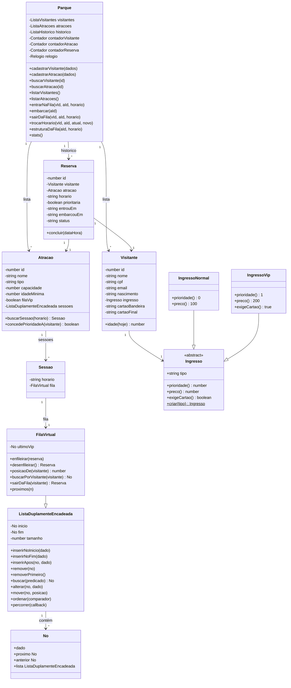

# 🎡 Parque do Terror

Sistema de reservas e filas virtuais para as atrações de um parque temático de terror. Visitantes se cadastram, escolhem uma atração e um horário e entram em uma fila virtual específica. Quem tem ingresso **VIP** passa na frente dos ingressos normais nas atrações que possuem fila prioritária. A equipe do parque acompanha as filas, chama as sessões e consulta as métricas do dia.

O projeto foi feito em dupla, com Node.js e uma stack leve, pensada para instalar e rodar em segundos. **Sem banco de dados:** toda a persistência é feita em **listas encadeadas em memória**, dentro da classe `Parque`.

## Sumário

- [Funcionalidades](#funcionalidades)
- [Tecnologias](#tecnologias)
- [Como executar](#como-executar)
- [Telas e rotas](#telas-e-rotas)
- [Regras de negócio](#regras-de-negócio)
- [Fila encadeada com prioridade](#fila-encadeada-com-prioridade)
- [Modelo de dados](#modelo-de-dados)
- [Estrutura de pastas](#estrutura-de-pastas)
- [Diagrama de classes](#diagrama-de-classes)
- [Decisões de projeto](#decisões-de-projeto)
- [Limitações conhecidas](#limitações-conhecidas)
- [Equipe](#equipe)

## Funcionalidades

**Cadastro de atrações**
- Nome, tipo, capacidade máxima por sessão, idade mínima e horários disponíveis.
- Define se a atração possui fila prioritária (fila VIP).

**Cadastro de visitantes**
- Nome, e-mail, CPF, data de nascimento e tipo de ingresso (Normal ou VIP).
- O ingresso VIP só é liberado depois de adicionar um cartão de crédito.
- Mensagem de confirmação e redirecionamento ao painel do visitante depois do cadastro.

**Painel do visitante**
- Escolha do visitante em um seletor (não há login).
- Posição atual em cada fila em que está aguardando.
- Lista de atrações com os horários do dia e quantas pessoas já estão em cada fila.
- Botão **entrar na fila** por horário.
- Botão **SAIR** para sair de uma fila em que está aguardando.
- Botão **TROCAR** para mover o visitante de um horário para outro da mesma atração.
- Histórico com a data/hora de entrada na fila e a de embarque.

**Painel de controle do parque**
- Quantidade de pessoas na fila de cada atração.
- Fila desenhada como **lista encadeada visual**: `inicio → [Ana ★] → [Carla] → null → fim`.
- Próximos a embarcar, com a posição e destaque para VIPs.
- Botão **EMBARCAR**, que chama a sessão e faz a fila andar.

**Métricas do dia**
- Total de reservas, separado entre comuns e VIP (gráfico de pizza).
- **Ranking top 3** das atrações mais disputadas.
- **Ranking top 3** dos visitantes que mais usaram o sistema.

**Créditos**
- Tela com a equipe e as tecnologias usadas.

## Tecnologias

| Camada | Tecnologia |
| --- | --- |
| Servidor | Node.js + Express 4 |
| Páginas | EJS (renderização no servidor, sem build) |
| Armazenamento | **Listas encadeadas em memória** (sem banco de dados) |
| Estilo | CSS puro, fontes Cinzel, Cinzel Decorative, Nosifer, Hedvig Letters Serif e IBM Plex Sans (Google Fonts) |
| Estrutura de dados | Lista duplamente encadeada + fila virtual com prioridade |

Não há framework de front-end, etapa de compilação, nem banco de dados. Toda a persistência é feita em **listas encadeadas em memória**, dentro do objeto `Parque` (singleton). Edite um arquivo, salve e recarregue a página.

## Como executar

**Pré-requisitos:** Node.js 22 ou superior e npm. As fontes são carregadas do Google Fonts, então o visual completo precisa de internet.

```bash
# 1. Instalar as dependências
npm install

# 2. Subir o servidor com dados de exemplo
npm run demo
```

Acesse **http://localhost:3000**.

### Scripts

| Comando | O que faz |
| --- | --- |
| `npm start` | Inicia o servidor na porta 3000 (parque vazio). |
| `npm run demo` | Inicia o servidor **com dados de exemplo** e ignorando a hora real: todos os horários ficam abertos. Ideal para apresentar fora do horário das sessões. |
| `npm run seed` | Popula o parque com dados de exemplo e sai (útil para inspecionar sem subir o servidor). |

### Dados de exemplo

- **Atrações:** Trem do Terror, Cada Mal Assombrada, Montanha-Russa Maldita e Labirinto dos Sussurros.
- **Visitantes:** 9 pessoas, incluindo VIPs e uma criança de 10 anos, para mostrar o botão desabilitado por idade mínima.
- Algumas reservas já nascem aguardando e outras já concluídas, para o histórico não ficar vazio.

> Como o armazenamento é em memória, os dados **existem apenas enquanto o servidor está rodando**. `npm run demo` repopula tudo a cada inicialização.

## Telas e rotas

| Rota | Método | Descrição |
| --- | --- | --- |
| `/` | GET | Tela inicial |
| `/visitantes` | GET / POST | Cadastro de visitantes |
| `/visitantes/painel` | GET | Painel do visitante (`?visitante=ID` seleciona a pessoa) |
| `/visitantes/fila` | POST | Entrar na fila de uma atração em um horário |
| `/visitantes/sair-fila` | POST | Sair da fila de uma atração em um horário |
| `/visitantes/trocar-horario` | POST | Mover a reserva para outro horário da mesma atração |
| `/atracoes` | GET / POST | Cadastro de atrações |
| `/atracoes/painel` | GET | Painel de controle do parque |
| `/atracoes/:id/embarcar` | POST | Chama a próxima sessão da atração |
| `/metricas` | GET | Métricas e estatísticas do dia |
| `/creditos` | GET | Créditos da equipe |

## Regras de negócio

**Cadastro**
- O CPF deve ter exatamente 11 dígitos numéricos. CPF e e-mail não podem se repetir.
- A data de nascimento não pode estar no futuro.
- O ingresso VIP exige um cartão de crédito, que é **simulado**: nada é cobrado nem validado em operadora.
- Apenas a **bandeira e os 4 últimos dígitos** do cartão são guardados.

**Entrada na fila**
- O botão fica desabilitado se o visitante não tem a idade mínima da atração.
- Não é possível entrar duas vezes na mesma fila (mesma atração e horário) enquanto estiver aguardando. Depois de embarcar, pode entrar de novo.
- É possível entrar em horários diferentes da mesma atração.
- Horários que já passaram ficam como "horário encerrado" (a menos que o servidor rode com `npm run demo`).
- Se a atração **não tem fila VIP**, o visitante VIP entra como um visitante normal.

**Sair e trocar de horário**
- O visitante pode sair de uma fila em que está aguardando a qualquer momento.
- Pode trocar para outro horário da **mesma atração**, desde que o novo horário ainda esteja aberto e ele não esteja já nessa fila.
- Ao trocar, a reserva antiga é removida e uma nova reserva é criada no novo horário, com a mesma prioridade (VIP se aplicável).

**Embarque**
- O botão **EMBARCAR** chama, no máximo, a capacidade da sessão.
- A sessão chamada é o próximo horário (a partir da hora atual) que tenha gente aguardando. Se todos já passaram, usa o mais cedo que ainda tem fila.
- Se a fila tem menos gente que a capacidade, todos embarcam.
- Quem embarca sai da fila e a data/hora do embarque entra no histórico.

**Métricas**
- "Reservas do dia" conta as **entradas na fila** feitas hoje.
- A divisão comum/VIP usa o **tipo de ingresso** do visitante.
- O ranking é montado com o método `ordenar()` da lista encadeada (insertion sort estável).

## Fila encadeada com prioridade

Cada combinação **atração + horário** tem a sua própria fila, implementada como uma **lista duplamente encadeada com prioridade** em [`models/FilaVirtual.js`](models/FilaVirtual.js).

```
inicio → [Ana ★] ⇄ [Carla ★] ⇄ [Gabi] → null
                 ↑
             ultimoVip
```

A fila guarda três ponteiros: `inicio` (próximo a ser atendido), `fim` (último da fila) e `ultimoVip` (último nó VIP).

| Operação | Comportamento | Custo |
| --- | --- | --- |
| `enfileirar` (normal) | Entra no fim da fila, ligando-se ao nó apontado por `fim`. | O(1) |
| `enfileirar` (VIP) | Entra logo depois do último VIP, ou no início se não há VIP. Passa na frente de todos os normais. | O(1) |
| `desenfileirar` | Remove e devolve o nó do início. Se era o último VIP, `ultimoVip` é atualizado. | O(1) |
| `posicaoDe` | Posição do visitante na fila (1 = próximo). | O(n) |
| `sairDaFila` | Remove o visitante do meio da fila, reajustando `ultimoVip` se necessário. | O(n) |
| `proximos(n)` | Devolve uma nova lista com os próximos N, sem tirá-los da fila. | O(n) |

**Onde a fila é usada**
- Cada `Sessao` (atração + horário) tem a sua própria `FilaVirtual`.
- O `Parque` expõe métodos que operam nessas filas: `entrarNaFila`, `embarcar`, `sairDaFila`, `trocarHorario`.
- A interface do painel do parque desenha a fila como **corrente visual**, mostrando `inicio → [Ana ★] → [Carla] → null → fim`.

## Modelo de dados

Não há banco de dados. Todo o armazenamento é feito em **listas duplamente encadeadas** dentro do objeto `Parque` (singleton):

| Lista | O que guarda |
| --- | --- |
| `ListaVisitantes` | Todos os visitantes cadastrados (busca por CPF e e-mail) |
| `ListaAtracoes` | Todas as atrações (busca por nome) |
| `ListaHistorico` | Todas as reservas (histórico completo) |

Cada **Atracao** tem uma lista de **Sessões**. Cada **Sessão** tem a sua própria **FilaVirtual**.

### Classes de domínio

| Classe | Papel |
| --- | --- |
| `Parque` | **Singleton.** Guarda as listas, os contadores de IDs e o relógio. Todas as regras de negócio vivem aqui. |
| `Visitante` | Nome, CPF, e-mail, nascimento, ingresso, cartão. Método `idade()`. |
| `Atracao` | Nome, tipo, capacidade, idade mínima, fila VIP, lista de `Sessao`. |
| `Sessao` | Horário + a sua própria `FilaVirtual`. |
| `Reserva` | Visitante + atração + horário + prioridade + status + timestamps. |
| `Ingresso` | **Fábrica.** Cria `IngressoNormal` ou `IngressoVip` (com polimorfismo em `prioridade()` e `preco()`). |
| `FilaVirtual` | Fila com prioridade VIP (herda de `ListaDuplamenteEncadeada`). |
| `ListaDuplamenteEncadeada` | Estrutura base: `inserirNoInicio`, `inserirNoFim`, `remover`, `buscar`, `ordenar`, `mover`. |
| `No` | Nó da lista (dado + `proximo` + `anterior`). |
| `Contador` | Gerador de IDs sequenciais (substitui o `AUTOINCREMENT` do SQLite). |
| `Relogio` | Relógio injetável (modo demo). Nenhuma classe lê a hora direto. |

## Estrutura de pastas

```
.
├── server.js              # Express: rotas e validações dos formulários
├── dados-exemplo.js       # Popula o Parque com dados fictícios (modo demo)
├── package.json
├── models/                # Classes de domínio (orientação a objetos)
│   ├── Parque.js          # Singleton (cérebro do sistema)
│   ├── Visitante.js       # Visitante do parque
│   ├── Atracao.js         # Atração + lista de Sessões
│   ├── Sessao.js          # Horário + FilaVirtual
│   ├── Reserva.js         # Reserva (visitante + atração + horário)
│   ├── Ingresso.js        # Fábrica (Normal / VIP)
│   ├── FilaVirtual.js     # Fila com prioridade VIP
│   ├── ListaDuplamenteEncadeada.js  # Estrutura base
│   ├── ListaVisitantes.js # Lista especializada
│   ├── ListaAtracoes.js   # Lista especializada
│   ├── ListaHistorico.js  # Lista especializada
│   ├── No.js              # Nó da lista
│   ├── Contador.js        # Gerador de IDs
│   └── Relogio.js         # Relógio injetável
├── public/                # Arquivos estáticos
│   ├── style.css
│   └── *.png              # Imagens de fundo, logomarca, troféus e avatares
├── test/                  # Testes das estruturas de dados
└── views/                 # Páginas EJS
    ├── index.ejs
    ├── metricas.ejs
    ├── creditos.ejs
    ├── partials/          # head.ejs (menu) e foot.ejs
    ├── atracoes/          # cadastro.ejs e painel.ejs
    └── visitantes/        # cadastro.ejs e painel.ejs
```

## Diagrama de classes



## Decisões de projeto

- **Listas encadeadas em vez de banco de dados.** O documento da disciplina pedia que as listas encadeadas tivessem papel relevante no armazenamento de dados. A gente migrou tudo do SQLite para listas em memória, com IDs gerados por contador.
- **Singleton para o Parque.** Uma única instância (`module.exports = new Parque()`) garante que todos os módulos vejam o mesmo estado e que os IDs não colidam.
- **Fábrica para o Ingresso.** `Ingresso.criar(tipo)` devolve a instância correta. A prioridade vem de `ingresso.prioridade()` — não há `if (ingresso === 'vip')` espalhado pelo código.
- **Relógio injetável.** O `Parque` recebe um `Relogio` no construtor. Isso permite testar com hora fixa (`Relogio.fixo('2026-10-10 14:00:00')`) e manter o modo demo (`npm run demo`).
- **Seletor no lugar de login.** O painel foi pensado para uso interno de quem trabalha no parque. O visitante escolhido fica guardado em um cookie.
- **Cartão simulado.** Mesmo em um projeto acadêmico, não se guarda o número completo do cartão. Só a bandeira e os 4 últimos dígitos.
- **Lógica separada da interface.** Regras de negócio vivem nas classes (em `models/`). O `server.js` só repassa dados. As views só exibem.

## Limitações conhecidas

- **As filas ficam em memória.** Se o servidor reiniciar, as filas se perdem. No modo `npm run demo`, o `dados-exemplo.js` repopula tudo a cada inicialização.
- **Não há autenticação.** Qualquer pessoa que acesse o sistema pode escolher qualquer visitante e usar o painel do parque.
- **Pagamento e cartão são simulados.**
- **Um único processo.** Como as filas vivem na memória do processo, não dá para rodar várias instâncias do servidor ao mesmo tempo.
- **Sem persistência em arquivo.** Foi uma decisão consciente para o escopo acadêmico; em produção, seria interessante salvar as listas em JSON.

## Equipe

Projeto desenvolvido em dupla por **Dayvson** e **Yuri Calixto**. Os links de cada integrante estão na tela de Créditos do sistema.